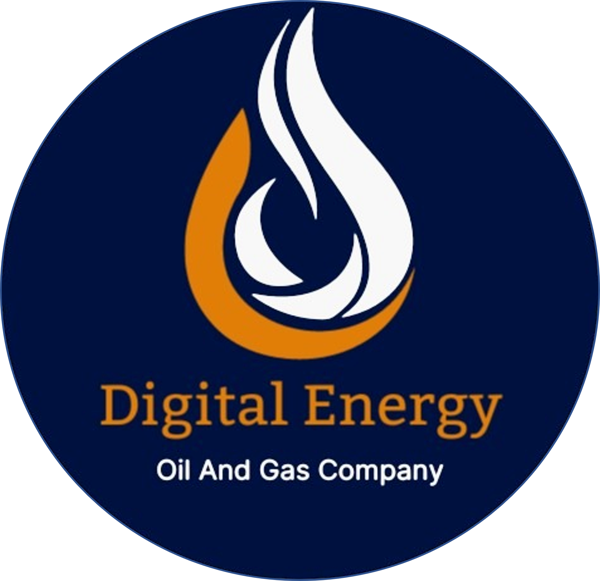

**Proyecto Integrador - Digital House**

<h1 align="center">DIGITAL ENERGY</h1>
<h1 align="center">COMERCIALIZACIÓN DE HIDROCARBUROS Y DERIVADOS</h1>

  

## Descripción del proyecto
Digital Energy es una empresa argentina especializada en la extracción y comercialización de hidrocarburos y derivados. En la actualidad, estamos en un proceso de expansión y exploración de nuevos mercados internacionales para diversificar nuestras operaciones y aprovechar nuevas oportunidades de crecimiento. 

## 🎯 Objetivo
El proyecto tiene como objetivo analizar indicadores clave y evaluar mercados potenciales para determinar las regiones y países más atractivos para realizar inversiones estratégicas.

## 🛠️ Herramientas implementadas 
- **Power BI :**  Para la visualización y análisis de datos.
- **PowerPoint :**  Para la creación de presentaciones de resultados.
- **Canva :**  Para el diseño de elementos gráficos.

## Contenidos del Proyecto

### 📊 Dashboard
**Descripción:** Visualización interactiva de los datos relacionados con el abandono del carrito.

- **Archivo principal:** [`Abandono_Carrito_AMAZON_NoCountry (Power BI)`](Dashboard/Abandono_Carrito_AMAZON_NoCountry.pbix)
- **Capturas de pantalla:** [`Imágenes de cada solapa del dashboard de Power BI para una visualización rápida.`](Dashboard)

### 📂 Data
**Descripción:** Conjunto de datos y documentación relacionada con el proceso de transformación de datos.

- **Dataset original:** [`Amazon Customer Behavior Survey`](Data)
- **ETL:** [`Amazon Customer Behavior Survey ETL`](Data) - Documento que detalla los pasos de Extracción, Transformación y Carga (ETL) realizados para preparar los datos para el análisis.

 
### 📑 Presentation
**Descripción:** Informe final con conclusiones y recomendaciones basadas en los datos analizados.

- **Presentación:** [`NoCountry_c19_111_m_data_BI`](Presentation) - PowerPoint que incluye un análisis detallado de las problemáticas detectadas y las posibles soluciones propuestas.

## 📢 Conclusiones clave
Análisis Estratégico para la Expansión Internacional: Identificación de Mercados Clave y Oportunidades de Crecimiento para Digital Energy.

- **Plazas Internacionales de Interés:** La región Asia-Pacífico, con un enfoque en China y Japón, y América del Norte, con un enfoque en Canadá, presentan oportunidades significativas debido a su alta demanda energética, crecimiento económico sostenido y ubicación estratégica.
- **Estrategia de Expansión:** La combinación de reservas abundantes en Canadá y la demanda creciente en China y Japón nos permitirá posicionarnos estratégicamente en mercados clave, reducir costos logísticos y ofrecer precios competitivos.
- **Análisis FODA:** Hemos llevado a cabo un análisis FODA que ha permitido identificar las Fortalezas, Oportunidades, Debilidades y Amenazas tanto internas como externas para Digital Energy. Este análisis ha facilitado la comprensión de cómo nuestras fortalezas se pueden utilizar para aprovechar las oportunidades del mercado, mientras abordamos nuestras debilidades y enfrentamos las amenazas externas.

**¡Gracias por revisar nuestro proyecto! Esperamos que nuestros análisis y recomendaciones sean valiosos para comprender mejor las estrategias de expansión internacional y mejorar la toma de decisiones en el ámbito de los hidrocarburos.**
